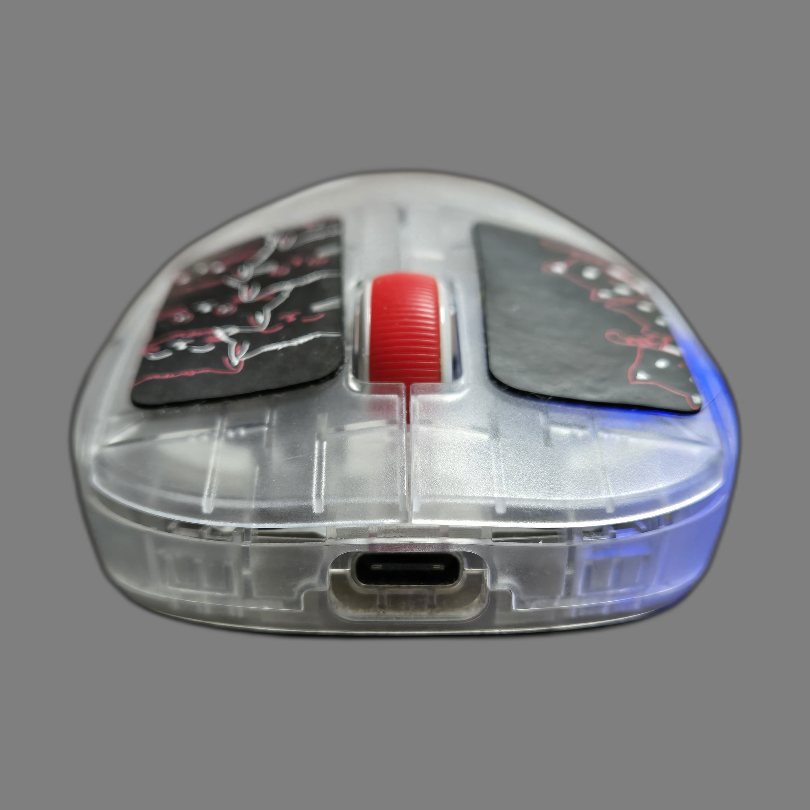
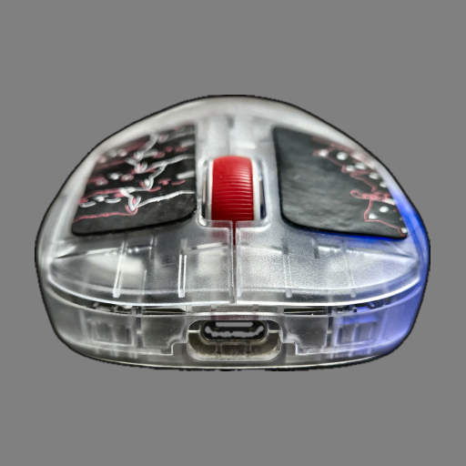
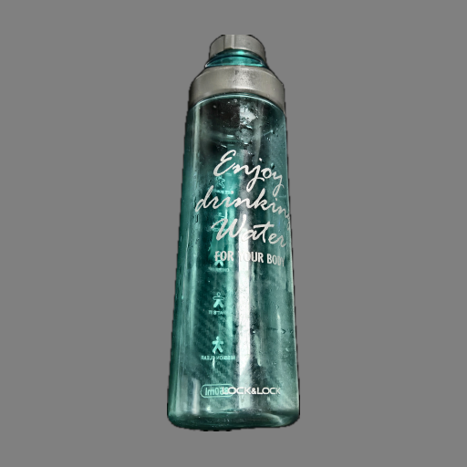
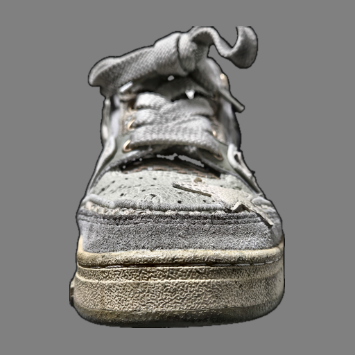
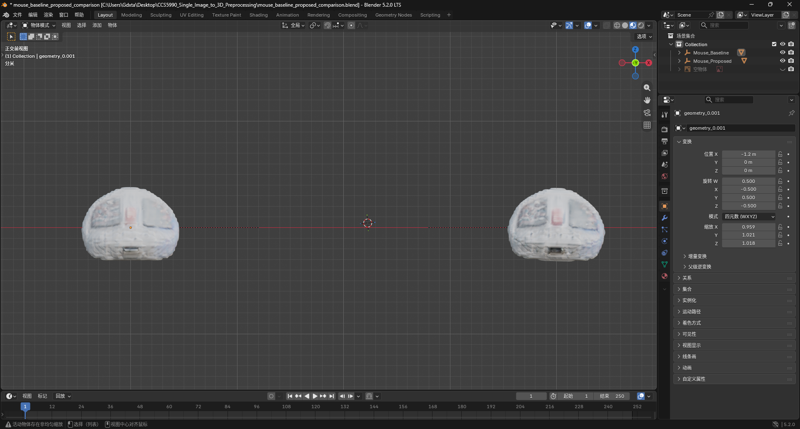
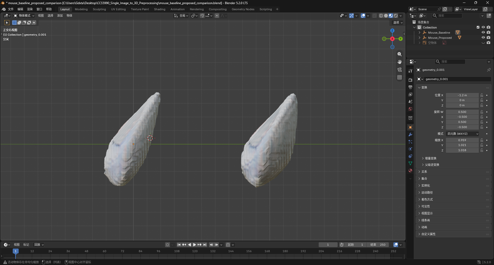
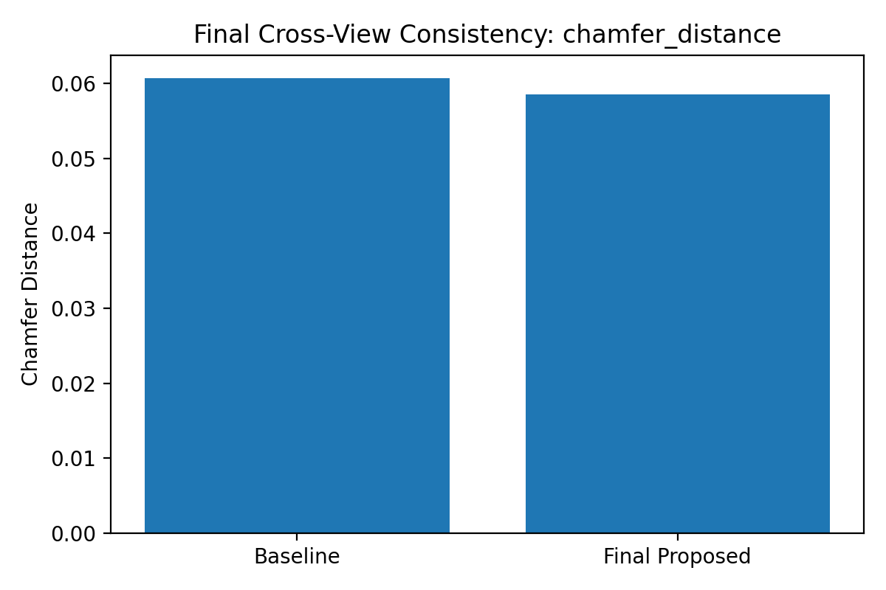
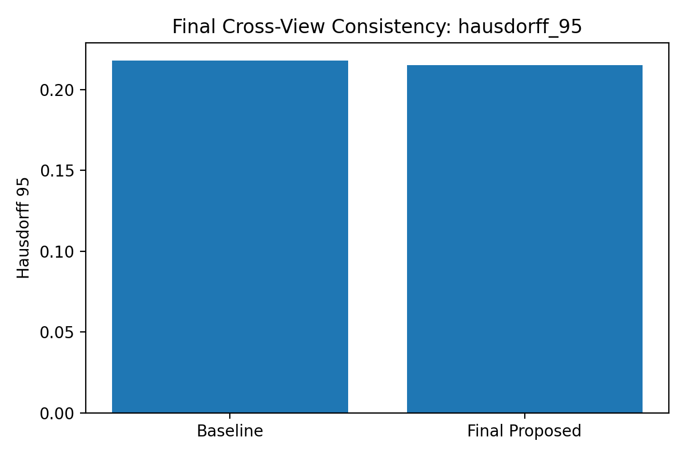
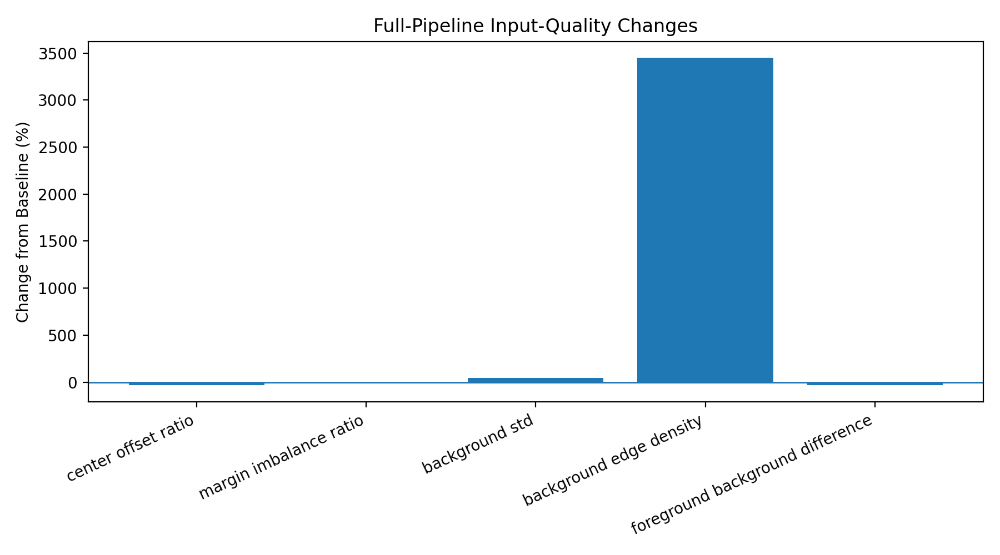
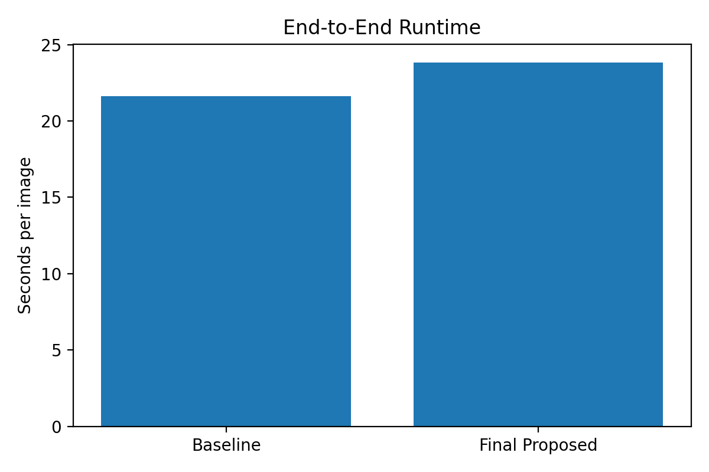

# Single-Image-to-3D Preprocessing

Automated image pre-processing and evaluation pipeline for improving single-image-to-3D generation with TripoSR.

## Overview

This project investigates whether automated image pre-processing can improve the quality and consistency of single-image-to-3D reconstruction without modifying the underlying 3D generation model.

The pipeline applies image processing operations before passing the input image to TripoSR, followed by quantitative evaluation of the generated 3D meshes.

This project was developed as part of my CCS5990 Master's research project at Universiti Putra Malaysia.

## Pipeline

```text
Input Image
    ↓
Background Removal
    ↓
Object-Centered Cropping
    ↓
Adaptive Padding / Object Scaling
    ↓
Image Enhancement
    ↓
TripoSR
    ↓
3D Mesh
    ↓
Evaluation
```

## Pre-processing Methods

- Background removal
- Object-centered cropping
- Adaptive padding and object-scale normalization
- CLAHE-based contrast enhancement
- Sharpening and edge-preserving processing
- TripoSR-ready image preparation

Additional Pipeline V2 experiments evaluate different object-to-canvas ratios and enhancement configurations.

## Tech Stack

**Python · OpenCV · NumPy · Pillow · SciPy · Matplotlib · Trimesh · rembg · TripoSR · PyTorch · Blender**

## Experimental Setup

The controlled experiment currently evaluates three object categories:

**Mouse · Bottle · Shoe**

Each object is evaluated from five viewpoints:

**Front · Back · Left · Right · Top**

The experiments compare baseline and pre-processed inputs using geometric, cross-view consistency, and runtime measurements.

## Pre-processing Examples

### Original Inputs

| Mouse | Bottle | Shoe |
| --- | --- | --- |
|  |  |  |

### Pre-processed Inputs

| Mouse | Bottle | Shoe |
| --- | --- | --- |
|  |  |  |

## 3D Reconstruction Comparison

### Front View



### Side View



## Evaluation

### Mesh Evaluation

The generated meshes are evaluated using metrics including:

- Vertex and face counts
- Connected components
- Degenerate faces
- Watertightness
- Euler characteristic

### View Consistency

Reconstructions generated from different viewpoints are compared to evaluate geometric consistency.

### Runtime

The project separately measures:

- Image pre-processing runtime
- TripoSR generation runtime
- End-to-end runtime

### Ablation Study

Ablation experiments evaluate how individual pre-processing stages affect reconstruction results.

## Selected Experimental Results

### Chamfer Distance



### Hausdorff-95 Distance



### Input Quality Changes



### End-to-End Runtime



## Repository Structure

```text
Single-Image-to-3D-Preprocessing/
│
├── README.md
├── requirements.txt
├── .gitignore
│
├── scripts/
│   ├── preprocessing/
│   ├── corrected_pipeline/
│   └── pipeline_v2/
│
├── examples/
│   ├── inputs/
│   └── preprocessed/
│
└── results/
    ├── mesh/
    ├── view_consistency/
    ├── runtime/
    ├── ablation/
    ├── pipeline_v2/
    └── figures/
```

## Code Organization

`scripts/preprocessing/` contains the core image pre-processing implementation.

`scripts/corrected_pipeline/` contains the corrected controlled experimental pipeline, including 3D generation, mesh evaluation, view-consistency analysis, runtime benchmarking, and ablation experiments.

`scripts/pipeline_v2/` contains subsequent pipeline optimization experiments, including object-to-canvas ratio selection, edge cleaning, foreground processing, CLAHE, and sharpening experiments.

## Installation

Install the Python dependencies with:

```bash
pip install -r requirements.txt
```

TripoSR should be installed separately and placed in the project environment according to its original installation instructions.

## Current Status

This repository contains the controlled experimental pipeline and selected evaluation results.

The initial controlled dataset is intentionally small and is primarily used to validate the experimental workflow. Expansion to additional object categories and public datasets is part of the ongoing research.

The current results should therefore be interpreted as experimental findings rather than as evidence of general improvement across all single-image-to-3D reconstruction tasks.

## Research Goal

The goal of this project is to investigate whether a lightweight automated image pre-processing module can improve the reliability of single-image-to-3D reconstruction while keeping the underlying 3D generation model unchanged.

## Author

**Kumbacat-leon**

Master's Project in Computer Science  
Universiti Putra Malaysia
